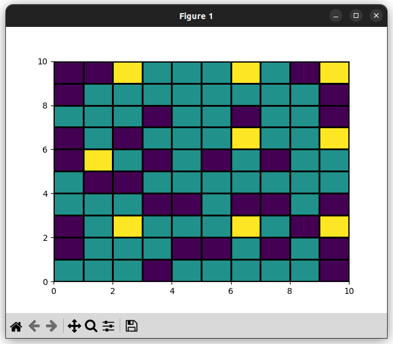
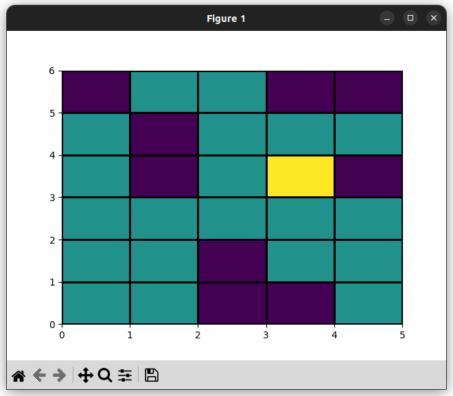
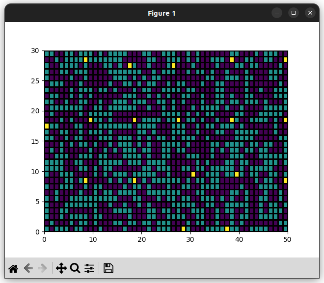

# City Grid Test
Одно из тестовых заданий. Полностью описать не могу, но смысл передам. Нужно было сделать говрод в виде сетки. В городе есть "плохие" здания (фиолетовые клетки).
Нужно было разместить вышки связи (жёлтые клетки) в городе так, что бы они покрывали связью весь город. У вышек есть радиус действия. На "плохие" здания вышки ставить нельзя.
Город создаётся рандомно, вышкек ставится как можно меньше, но только что бы выполнялось задание.
## Задача 1
Блоки с препятствиями разместил рандомно с помощью random.sample в методе make_grid.
## Задача 2
Размещение башни и её покрытия реализованно методами place_one_tower и cover_blocks соответственно.
## Задача 3
Оптимизация размещения реализовывалась с помощью жадного алгоритма в методе place_towers.
## Задача 4
Для поиска путей сначала создаётся граф в методе find_connections, после чего для каждой вышки ищется оптимальный путь
до любой другой вышки с помощью алгоритма Дейкстры в методе dijkstra.
## Задача 5
Простая визуализация с помощью matplotlib в методе visualization.

Скриншоты с результатами работы программы

